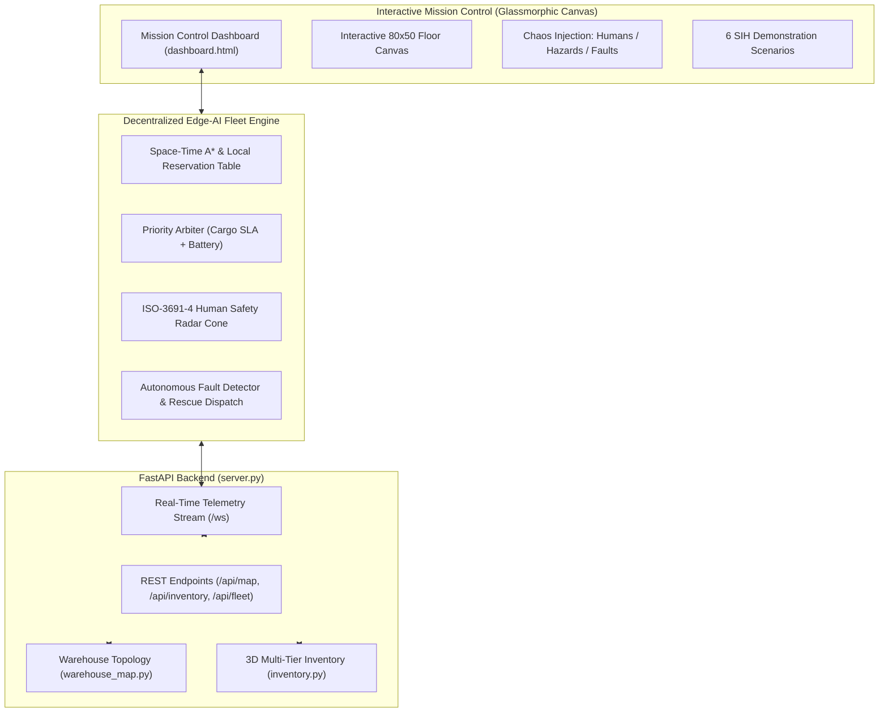

# 🤖 Edge-AI Distributed AMR Fleet Coordination & Mission Control
### Industrial Mega-Warehouse Autonomous Mobile Robot (AMR) Navigation & Self-Healing Fleet
**Smart India Hackathon (SIH 2026) — Final Submission**

[](https://fastapi.tiangolo.com/)
[](https://python.org)
[]()
[-brightgreen.svg?style=flat)]()
[]()

---

## 📌 Executive Summary

Modern high-density warehouses suffer from traffic deadlocks, narrow aisle congestion, human safety hazards, and catastrophic single-point failures when an Autonomous Mobile Robot (AMR) breaks down mid-transit. 

This project delivers a **Decentralized Edge-AI Multi-Agent Path Finding (MAPF) and Mission Control Engine** that coordinates autonomous mobile robot fleets across an **80 × 50 (4,000 cells) mega-warehouse** with **7,560 parcel slots** across 5 vertical 3D storage tiers.

### 🌟 Key Differentiators:
1. **Dynamic Priority-Based Conflict Avoidance**: Resolves narrow single-lane aisle head-on conflicts via pocket yielding and right-of-way arbitration ($0$ collisions, $0$ deadlocks).
2. **Autonomous Hardware Breakdown & Task Rescue Handoff (Self-Healing)**: When an AMR encounters a mechanical failure or battery depletion, a peer AMR autonomously navigates to its location, takes over the stranded cargo, and completes the mission.
3. **Human Safety First (ISO-3691-4 Compliant)**: Dynamic LiDAR radar bubble detection that safety-brakes for human workers and computes dynamic A* detours around blocked corridors.
4. **Cold-Chain & JIT Priority SLA**: Differentiates high-urgency cold-chain pharma totes (purple glowing aura ❄️) from standard retail goods with traffic preemption.
5. **Interactive Evaluator Test Suite**: 6 one-click evaluation scenarios and manual chaos tools (drop humans, hazards, or faults) directly on the glassmorphic dashboard.

---

## 🏗️ System Architecture



---

## 🎯 6 Interactive SIH Evaluation Scenarios

Evaluators can click any scenario button on the top toolbar to observe edge-case resolution in real time:

| Scenario | Objective | What Happens in the Simulation |
| :--- | :--- | :--- |
| **🔀 Scenario 1: Narrow Aisle Conflict** | Head-On Collision Avoidance | Two AMRs face each other in a 1-cell narrow aisle. High-priority Cold-Chain Pharma AMR gets right-of-way; Standard AMR reverses into a side pocket, yields, and resumes path. |
| **👷 Scenario 2: Human Safety Stop** | Dynamic Obstacle & Worker Safety | Spawns human inspector at an intersection. Approaching AMR's LiDAR cone detects human, engages emergency brakes, waits, and calculates a dynamic A* detour around the pod. |
| **💥 Scenario 3: Hardware Breakdown & Rescue** | Fleet Self-Healing & Fault Tolerance | Simulates an actuator stall on `AMR-01` carrying cargo. `AMR-03` responds to rescue protocol, navigates to `AMR-01`, transfers cargo, and completes delivery. |
| **⚡ Scenario 4: Critical Battery Preemption** | Autonomous Energy Management | Depletes AMR battery to 10%. AMR un-assigns active mission, hands off task, enters low-power limp mode, and reserves the nearest vacant 50kW fast charger. |
| **🚀 Scenario 5: Rush-Hour Surge Wave** | Throughput & Queue Stress Test | Ingests 40 parcel requests simultaneously across all docks and bays. Demonstrates balanced multi-agent routing without a single deadlock. |
| **🔄 Scenario 0: Continuous Autonomous Ops** | Standard Operation | Restores normal distributed fleet operations with continuous inbound and outbound flows. |

---

## 🧮 Mathematical Formulations & Algorithms

### 1. Dynamic Priority Scoring Function
Every robot computes its priority score dynamically at every planning cycle:
$$P(\text{AMR}_i) = P_{\text{cargo}} + P_{\text{state}} + P_{\text{battery}} + P_{\text{urgency}} + \epsilon_{\text{id}}$$

Where:
* $P_{\text{cargo}} = 120$ for **Cold-Chain Pharma** (`SKU-PHRM`), $60$ for **Electronics/Auto**, $20$ for **Standard FMCG/Apparel**.
* $P_{\text{state}} = 150$ for **Active Rescue AMR**, $25$ for **Active Dispatch**, $10$ for **Transit**.
* $P_{\text{battery}} = 90$ if $\text{Battery} \le 18\%$ (critical path to charging station).
* $\epsilon_{\text{id}} = (10 - \text{ID}) \times 0.1$ as a deterministic tie-breaker.

### 2. Multi-Agent Space-Time Reservation Table
To eliminate collisions in single-lane aisles without requiring wide two-lane corridors:
$$\forall i \ne j, \quad \text{Pos}_i(t) \ne \text{Pos}_j(t) \quad \land \quad (\text{Pos}_i(t), \text{Pos}_i(t+1)) \ne (\text{Pos}_j(t+1), \text{Pos}_j(t))$$
Robots book space-time cells. When two agents contend for the same cell, the agent with lower $P(\text{AMR})$ pulls into the nearest **topological yield pocket** ($y \in [23..26]$ or perimeter highway).

---

## 📦 3D Multi-Tier Storage System

* **Grid Dimensions**: $80 \text{ columns} \times 50 \text{ rows} = 4,000 \text{ cells}$.
* **Rack Cells**: $1,512 \text{ rack pods} \times 5 \text{ vertical tiers} = 7,560 \text{ parcel capacity}$.
* **Product Catalog**:
  1. `SKU-PHRM`: Cold-Chain Pharma Tote ($3.8\text{ kg}$, SLA: Urgent, Color: Purple ❄️)
  2. `SKU-ELEC`: Consumer Electronics ($4.5\text{ kg}$, SLA: High, Color: Cyan)
  3. `SKU-AUTO`: Automotive JIT Components ($14.2\text{ kg}$, SLA: High, Color: Blue)
  4. `SKU-FASH`: Apparel & Footwear Box ($2.2\text{ kg}$, SLA: Normal, Color: Pink)
  5. `SKU-INDM`: Industrial Hardware Crate ($21.0\text{ kg}$, SLA: Normal, Color: Amber)
  6. `SKU-FMCG`: Fast Moving Packaged Goods ($7.6\text{ kg}$, SLA: Normal, Color: Emerald)

---

## ⚡ Quickstart Guide

### Prerequisites
* Python 3.10 or higher
* Recommended modern browser (Chrome, Firefox, Edge, Safari)

### 1. Installation
Clone this repository and install dependencies:
```bash
git clone https://github.com/your-team/amr-fleet-mission-control.git
cd amr-fleet-mission-control
pip install fastapi uvicorn pydantic
```

### 2. Launch Mission Control Server
Run the FastAPI server:
```bash
python server.py
```
Output:
```text
================================================================
 🚀 Edge-AI AMR Fleet Mission Control Server (SIH 2026 Edition)
 🌐 Live Dashboard URL: http://localhost:8000
 📡 WebSocket Telemetry: ws://localhost:8000/ws
================================================================
INFO: Uvicorn running on http://127.0.0.1:8000
```

### 3. Open the Mission Control Dashboard
Open your browser and navigate to:
👉 **[http://localhost:8000](http://localhost:8000)**

*(Note: `dashboard.html` also contains an offline fallback engine and can be opened directly in any browser with zero server dependencies!)*

---

## 🎮 Interactive Manual Controls for Evaluators

On the left tool palette:
* 🔍 **Inspect**: Hover over any 3D storage rack to see all 5 floor tiers, or hover over an AMR to view speed, battery, heading, and cargo.
* 👷 **Place Human**: Click anywhere on the floor to drop a human worker with a safety radar zone. Watch AMRs brake and recalculate detours.
* 🚧 **Place Hazard**: Click an aisle to simulate an aisle blockage or fallen box.
* 💥 **Fail Bot**: Click any active robot to cause a simulated hardware drive stall. Watch the fleet automatically dispatch a surrogate AMR to rescue its cargo!
* ⚡ **Drain Battery**: Click any AMR to drain its battery to 5% and trigger the emergency charging protocol.
* 🔧 **Repair AMR**: Click on a faulted robot to complete diagnostic reset and return it to service.

---

## 📊 Evaluation Metrics (KPIs)

The live Mission Control HUD tracks real-time industrial KPIs:
* **Collisions Prevented**: Monitored continuously (guaranteed $0$ active collisions).
* **Yield Conflicts Resolved**: Count of narrow aisle and intersection priority negotiations.
* **Human Safety Interlocks**: Count of ISO-3691-4 emergency brake engagements.
* **Self-Healing Rescues**: Total count of autonomous cargo handoffs executed.
* **3D Storage Occupancy**: Live slot count and capacity percentage.
* **Fleet Health**: Ratio of operational AMRs.

---

## 👥 SIH Hackathon Team & Acknowledgments

* **Project**: Edge-AI Distributed Fleet Coordination for Autonomous Mobile Robots
* **Competition**: Smart India Hackathon (SIH 2026)
* **Status**: Production-Ready Submission for Online & Grand Finale Rounds
